# Fluvsies Academy

This educational game for pre-schoolers, featuring the *Fluvsies Brand*.

## Table of Contents
- [Parental Area](#table-of-contents) (`+18`) Coming Soon!
- [Activity Flowchart](#activity-flowchart) (`WIP`) the overall vision 
- [Premium Access Config](#premium-access-config) (`easy`) locked / unlocked game state
- [Scene Management](#scene-management) (`easy`) moving between scenes
- [Activity Architecture](#activity-architecture) (`advanced`) single / multiple parts behind the scenes
- [Data and Difficulty](#data-and-difficulty) (`moderate`) how the difficulty is defined in the activity data
- [Audio System](#audio-system) (`easy`) 
- [Spine Animations Player](#spine-animations-player) (`moderate`) the base spine architecture to avoid re-implementing the players
- [Corner Fluvsie](#corner-fluvsie) (`moderate`) animated character UI that provides gameplay hints
- [Analytics Tracking](#analytics-tracking) (`easy`) tracking player behavior and progress

## Activity Flowchart

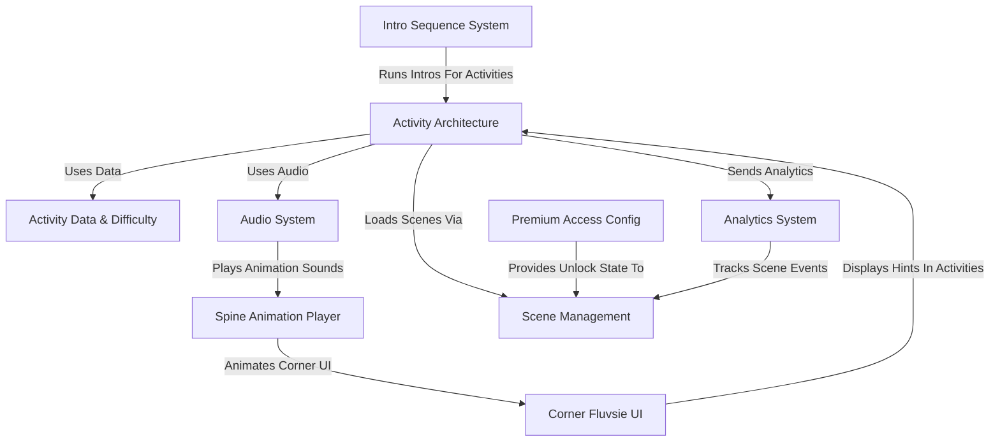

## Premium Access Config

**Purpose:** Provides a quick and reliable way to check if a player has access to premium content.

**Key Components:**
- Checks for active subscriptions (TutoClub/Single Game)
- Checks for unlock cheats
- Checks for special test groups (A/B tests)

**State Change Handling:**
```csharp
void OnEnable()
{
    // Start listening for the "unlock state changed" event
    PremiumAccessConfig.OnGameLockStateChange += HandleGameLockStateChanged;
    UpdateMainMenuUI(PremiumAccessConfig.IsGameUnlocked);
}

void OnDisable()
{
    PremiumAccessConfig.OnGameLockStateChange -= HandleGameLockStateChanged;
}
```

**Subscription Flow:**
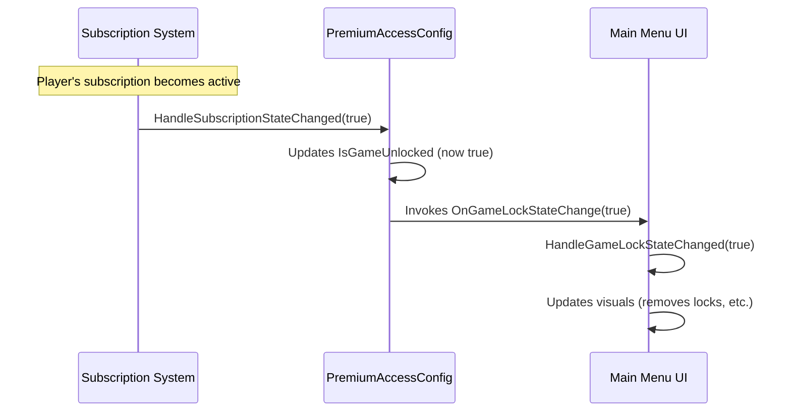

## Scene Management

**Key Components:**
1. **`Scenes` Enum**: A directory of all scenes with their build indices
2. **`SceneLoader`**: Handles scene transitions, loading screens, and analytics

**Scene Enum Example:**
```csharp
public enum Scenes
{
    None            = -1,
    TutoTOONSIntro  = 0,  // The intro animation scene
    LandingScreen   = 1,  // First-time screen
    MainMap         = 2,  // The main menu/map screen
    
    // Activities
    ShoppingList    = 3,
    HappyScales     = 4,
    // ... more activities
    TeethCleaning   = 9,
    HandsWashing    = 10
}
```

**Loading an Activity:**
```csharp
private void LoadTargetActivity(BaseActivityData _activityData)
{
    // Show loading screen
    LoadingScreen.TryShowLoadingScreen(
        _activityData.ActivityIcon,
        _activityData.AccentColor,
        _activityData.AudioData.TransitionInSound,
        ContinueLoading);
    
    // Load the scene
    void ContinueLoading()
    {
        SceneLoader.LoadSceneByIndex(_activityData.SceneIndex);
    }
}
```

## Activity Architecture

**Purpose:** Defines how activities start, track progress, determine success/failure, and navigate between steps.

**Types of Activities:**
1. **Simple Activities** - Single-mechanic (e.g., Color Cups sorting)
2. **Multi-Part Activities** - Multiple steps with different mechanics (e.g., Teeth Cleaning)

**Simple Activity Example:**
```csharp
public class ColorCupsController : BaseActivityController<BaseActivityData>
{
    protected override void Initialize()
    {
        // Setup the puzzle
    }

    private void HandleAllColorsSorted()
    {
        // Show ending
        EndActivitySuccess();
    }
}
```

**Multi-Part Activity Components:**
- `MultiplePartsActivityController`: Overall manager
- `BasePartsController`: Tracks progress through steps
- `ActivityPartBase`: Blueprint for each individual step

**Multi-Part Activity Flow:**
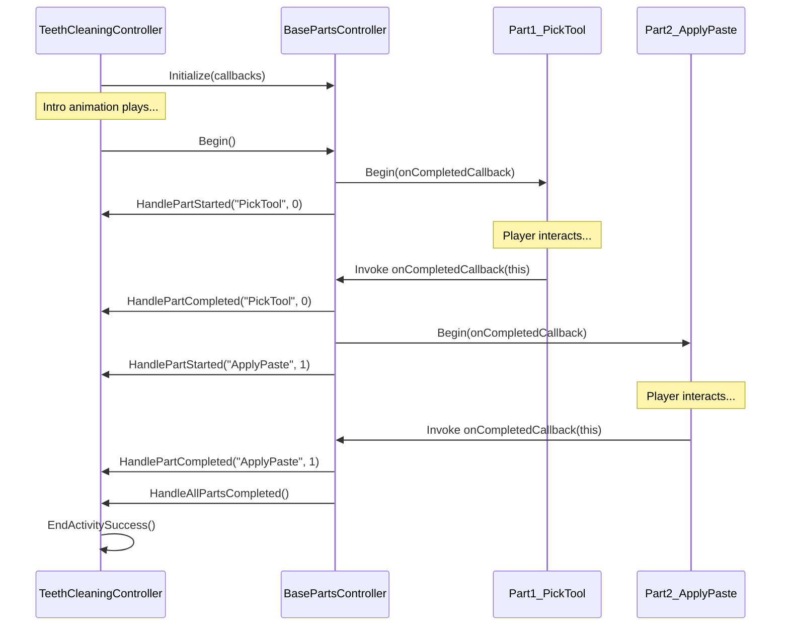

## Data and Difficulty

**Purpose:** Define activity-specific information and difficulty progression.

**Key Components:**
1. **BaseActivityData**: Container for activity info (name, scene, icon, color)
2. **BaseDifficultyDataset**: Collection of difficulty settings for ONE activity
3. **BaseDifficultyData**: ONE specific difficulty level with thresholds

**Data Flow:**
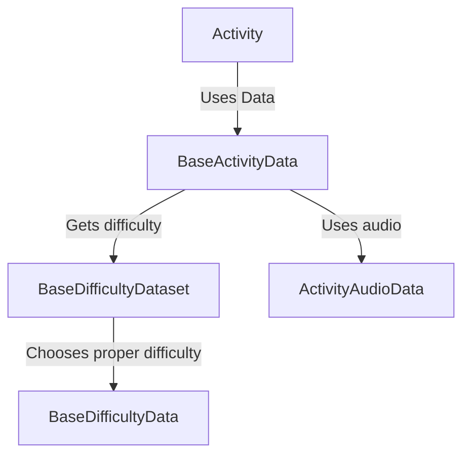

**Difficulty Selection Process:**
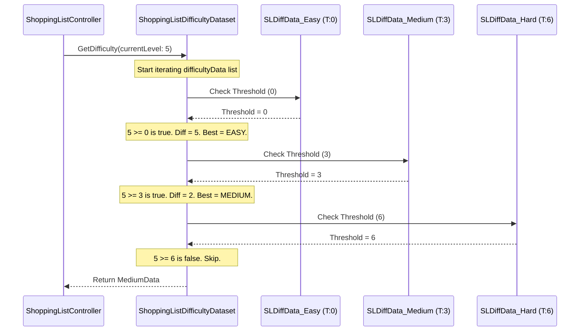

**Custom Difficulty Example:**
```csharp
public class ShoppingListDifficultyData : BaseDifficultyData
{
    [SerializeField] private int shoppingListLength; // How many items
    [SerializeField] private int itemsNeededMax;     // How many of each
    
    public int ShoppingListLength => shoppingListLength;
    public int ItemsNeededMax => itemsNeededMax;
}
```

## Audio System

**Purpose:** Controls all game sounds including background music, sound effects, voice-overs, and spatial sounds.

**Key Components:**
1. **AudioController (Singleton)**: Central manager for all sound playback
2. **AudioObject**: Component that plays a single sound
3. **NarratorPlayer**: Manages tutorial instructions and feedback
4. **NarrationCallbacks (Singleton)**: Event broadcaster for narrator requests
5. **Data Assets**: Sound clips organized by purpose

**Audio Controller Flow:**
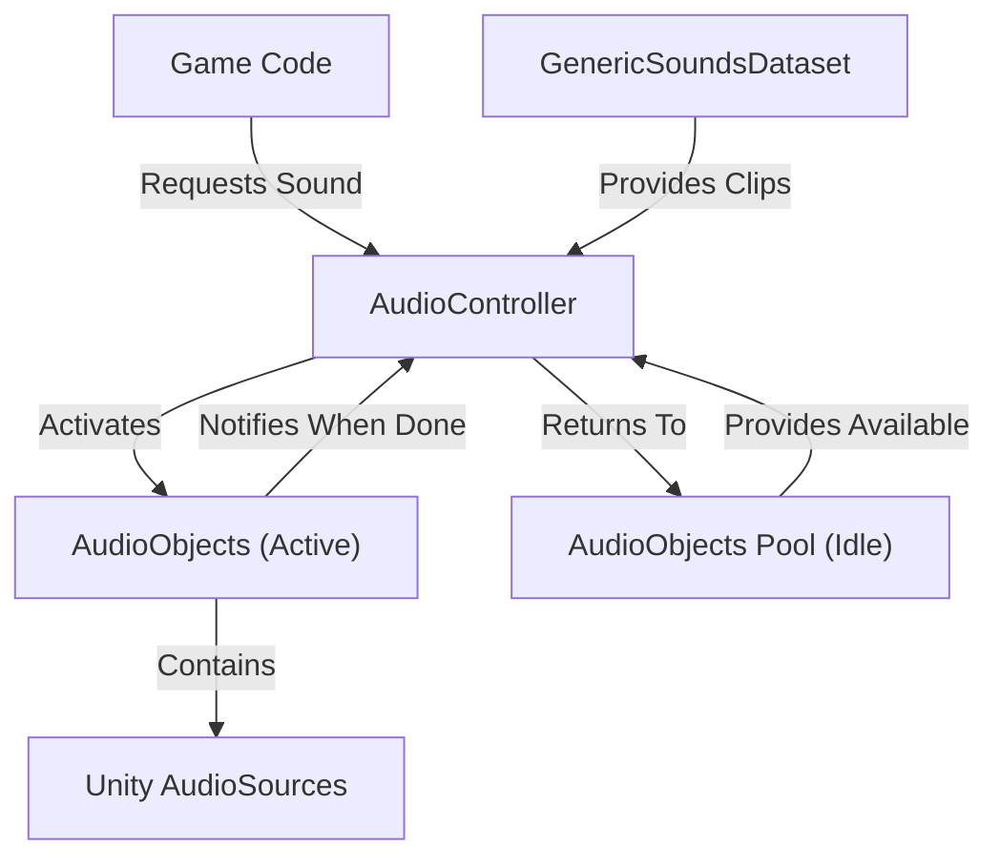

**Narrator System Flow:**
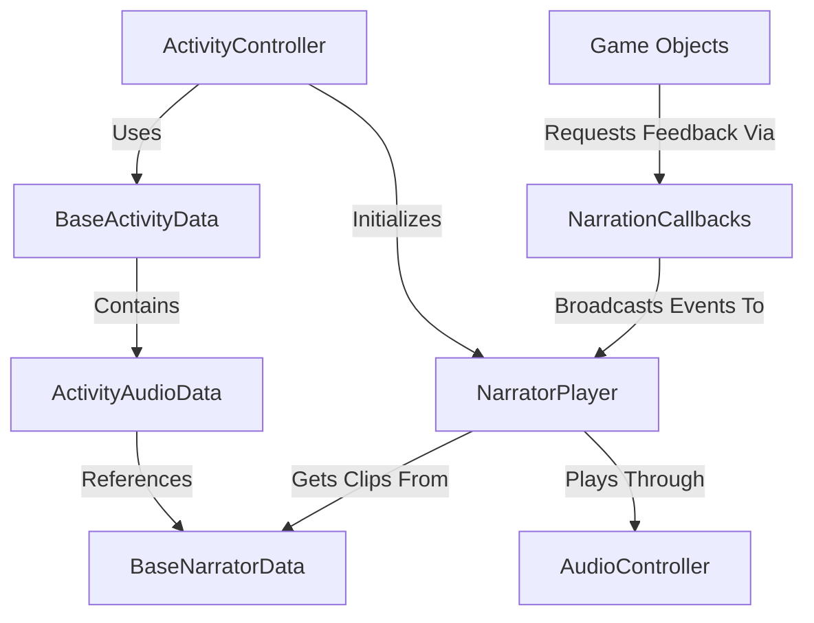

**Usage Examples:**
```csharp
// Play a sound effect
AudioController.TryPlayGenericSoundByName(GenericSoundName.PositiveFeedback);

// Request narrator feedback
NarrationCallbacks.GivePositiveFeedback();
```

## Spine Animations Player

**Purpose:** Manages character animations throughout the game.

**Key Components:**
1. **AbstractSpineAnimationsPlayer**: Defines common methods, connects with Audio System
2. **Specific Players**: WorldSpineAnimationsPlayer and UISpineAnimationsPlayer
3. **SpineAnimationsDataset**: Stores all animations for a character, grouped into "Mixes"
4. **SpineAnimationData**: Defines one specific animation with assets and sound effects

**Animation Flow:**
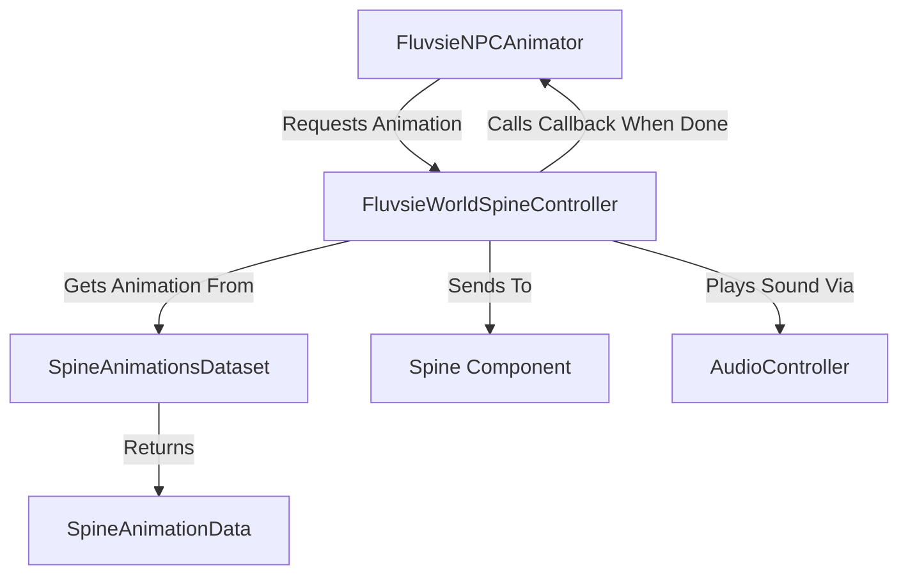

**Usage Examples:**
```csharp
// Play a random happy animation once
spineController.PlayRandomAnimation(
    FluvsieSpineAnimationsMixType.HappyMix,
    false,  // Don't loop
    PlayIdleWhenDone  // Callback function
);

// Play and loop random idle animation
spineController.PlayRandomAnimation(
    FluvsieSpineAnimationsMixType.IdleStandingMix,
    true  // Loop animation
);

// Play a specific greeting animation
spineController.PlayAnimation(
    FluvsieSpineAnimationName.Greetings_01,
    false,  // Don't loop
    ReturnToIdle  // Callback function
);
```

**Animation Reaction Example:**
```csharp
public void PlayPositiveReaction()
{
    // Stop any current animation
    spineController.SetEmptyAnimation((int)SpineAnimationTrack.Emotion);
    
    // Play a random happy animation
    spineController.PlayRandomAnimation(
        FluvsieSpineAnimationsMixType.HappyMix,
        false,
        PlayRandomIdleAnimation
    );
    
    isReacting = true;
}
```

## Corner Fluvsie

**Purpose:** Provides a reusable UI system for displaying hints and progress updates to the player through an animated character that appears in the corner of the screen (by default).

**Key Components:**
1. **`CornerFluvsie` (The Helper Character):**
   * The facade of the feature. Used to control the whole concept.
   * Found in `Prefabs/Shared/UI_CornerFluvsie`
   * Controls the character's appearance (showing/hiding)
   * Makes the character react with animations
   * Holds a reference to the hint bubble
   * Holds a flag `isAnchored` which means the Fluvsie will always stick to the right side of the screen
   
2. **`CornerBubble` (The Hint Bubble):**
   * Controls the content inside - a set of "`CornerBubbleSlot`"
   * Handles animations for showing, hiding, and updating hints
   * Automatically resizes cells depending on the visible slots count. (TODO: make this feature optional)
   
3. **`CornerBubbleSlot` (A Single Hint Item):**
   * Represents one individual item within the bubble
   * Displays either an `Image` or `Text`, or `both`
   * Handles animations by itself
   * Additional `Checkmark` feature

4. **`CornerBubbleSlotData` (The Data for a Slot):**
   * Found in `Activities/Shared/CornerFluvsie/CornerBubbleSlotData.cs`
   * Simple data structure holding the information needed to display in a slot

**Usage Example (Counting Bites Activity):**
```csharp
// Initialize Corner Fluvsie with initial hints (e.g., 3 apples)
private void InitializeCornerFluvsie()
{
    // Create data for the bubble slots
    UpdateCornerBubbleSlotsData();
    cornerFluvsie.Initialize(cornerBubbleSlotData, true);
    cornerFluvsie.Show();
}

// Update slot data for the bubble
private void UpdateCornerBubbleSlotsData()
{
    cornerBubbleSlotData = new List<CornerBubbleSlotData>();
    int _countNeeded = plate.GetChosenIngredientCount; // How many apples?
    Sprite _appleSprite = plate.CurrentChosenIngredient.IngredientSprite;

    // Add one slot data entry for each apple needed
    for (int i = 0; i < countNeeded; i++)
    {
        cornerBubbleSlotData.Add(new CornerBubbleSlotData(appleSprite));
    }
}

// Update progress with checkmarks
private void HandleSingleIngredientConsumed(Ingredient _ingredient)
{
    cornerFluvsie.MindBubble.SetCheckmark(ingredientIndex, true);
    ingredientIndex++;
}

// Update to new ingredients when all of one type are consumed
private void UpdateCornerFluvsieHints()
{
    // Create new data for different items (e.g., pears)
    UpdateCornerBubbleSlotsData();
    
    // Reset checkmarks and update the bubble content
    cornerFluvsie.ResetAllCheckmarks();
    cornerFluvsie.UpdateShowingSlots(cornerBubbleSlotData, true);
    
    // Make Fluvsie react positively
    cornerFluvsie.PlayApproveReaction();
}
```

**Sequence for "Consuming Apples" and "Showing Pears":**
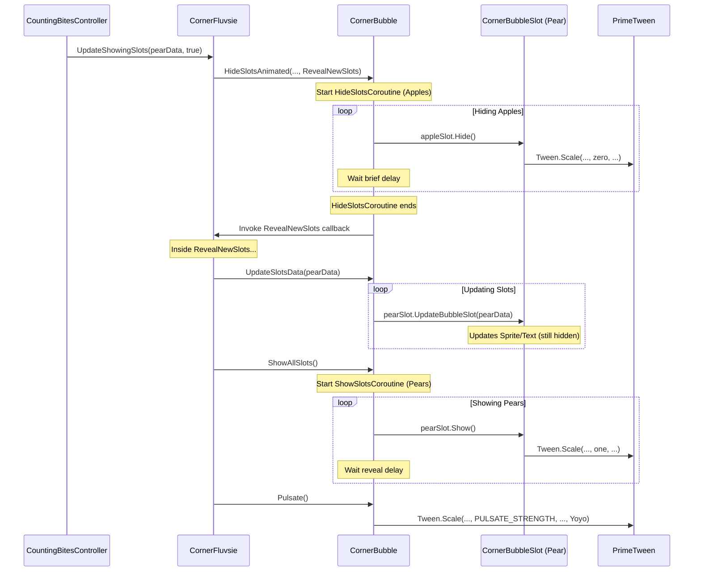

## Analytics Tracking

**Purpose:** Improve the gameplay & the team by analyzing various parts of the game.

**Key Components:**
1. **`AnalyticsTracker.cs` (The Event Reporter):**
   * Static, easy to use reporter for events
   * Each event *should be* named by it's purpose
   * Try to avoid `AnalyticsTracker.TrackCustom()`
   * Make sure to visely choose between `AnalyticsTracker.Track()` and `AnalyticsTracker.TrackOnce()`
   
2. **`AnalyticsDropOffTracker.cs` (The Progress Monitor):**
   * Tracks how far players get through a sequence of defined steps
   * Also static, pass the context
   
3. **`AnalyticsTrackerPersistentData.cs` (The Time Keeper):**
   * Tracks data across multiple play sessions
   * Calculates and sends reports of total time spent in previous sessions (or other various data that's not safe to be sent `OnApplicationQuit()`)

**Usage Example (Tracking Teeth Cleaning Activity):**
```csharp
// In BaseActivityController.Initialize()
protected virtual void Initialize()
{
    // Record activity start time
    startTime = Time.time;
    
    // Track activity started event
    AnalyticsTracker.TrackActivityStarted(activityData.ActivityName, currentDifficultyData.Rating);

}

// In BaseActivityController.EndActivitySuccess()
protected virtual void EndActivitySuccess()
{
    int _completionTime = (int)(Time.time - startTime);
    
    // Track activity completion
    AnalyticsTracker.TrackActivityCompleted(activityData.ActivityName, currentDifficultyData.Rating, _completionTime);
}

// In MultiplePartsActivityController.HandlePartStarted()
protected virtual void HandlePartStarted(TEnum _partName, int _partIndex)
{
    string _partLabel = _partName.ToString();
    DropOffPointContext _context = GetCurrentDropOffContext();
    int _playtime = (int)(Time.time - startTime);
    
    // Track this step as a drop-off point passed
    AnalyticsDropOffTracker.TryTrackDropOffPoint(_context, _partLabel, _playtime);
}
```
---
**Analytics Event Flow:**
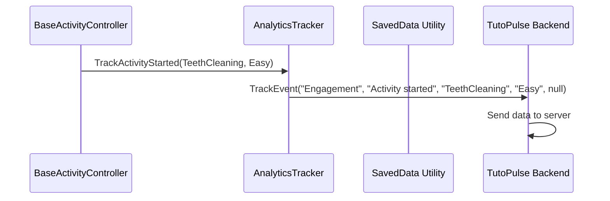
---
**Drop-Off Tracking Flow:**
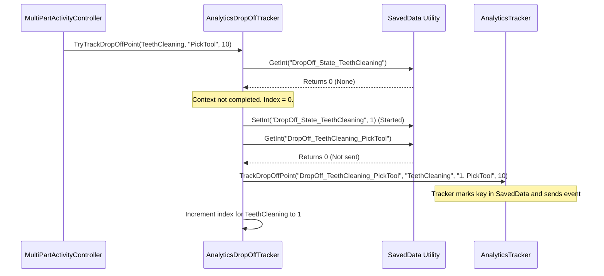
---

Thank ~~you~~ yourself for reading!