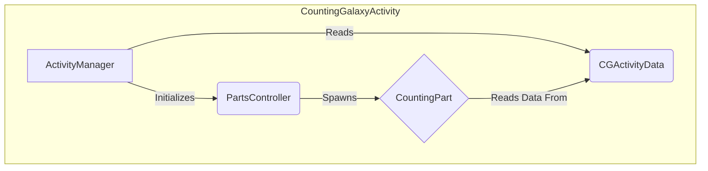

# Counting Galaxy Documentation

## Vision

A simple, engaging game for children to practice counting. The player helps a central planet "eat" smaller objects by clicking on them in the correct numerical order (1, 2, 3...). Correct clicks are rewarded with fun animations and sounds.

## Technical

### Architecture Overview

The system is managed by a main `ActivityManager` that uses a `PartsController` to spawn a `CountingPart`. The `CountingPart` gets its configuration and visual assets from a `CGActivityData` scriptable object.

### Component Breakdown

-   **`CountingGalaxyActivityManager`**: The main entry point. Initializes the activity, loads data, and manages cutscenes.
-   **`CGActivityData`**: A ScriptableObject holding all configuration data (number of items, visual "skins" for objects, game rules).
-   **`CountingGalaxyPartsController`**: Responsible for instantiating the `CountingPart` prefab.
-   **`CountingPart`**: The core game logic. Manages the user interaction, object animations, state (which number to click next), and win condition.
