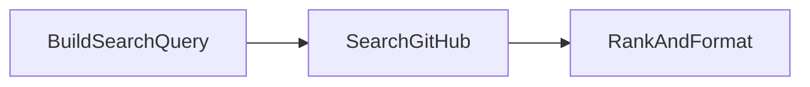
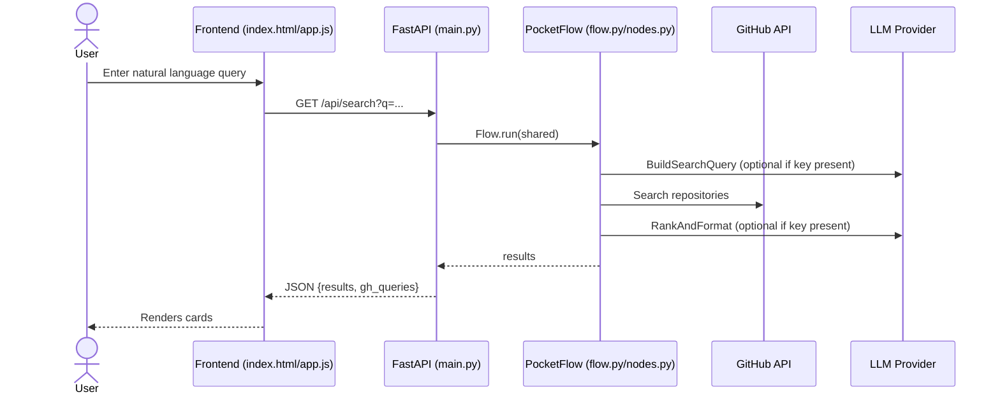

# AI GitHub Search (PocketFlow example)

An easy-to-host, good-looking, easy-setup web app to search GitHub repositories using natural language. Backend is Python FastAPI + PocketFlow; frontend is a static HTML page with Tailwind CSS.

## Quick start

1) Create a virtualenv and install deps

```
pip install -r cookbook/ai-github-search/requirements.txt
```

2) Set environment variables (optional but recommended)

```
# PowerShell (Windows)
$env:GITHUB_TOKEN="ghp_your_token_here"   # speeds up and raises rate limits
$env:OPENAI_API_KEY="sk-your-key"         # enables smarter query parsing and ranking
$env:LLM_PROVIDER="openai"                # openai|gemini|deepseek (default: openai)

# CMD (Windows)
set GITHUB_TOKEN=ghp_your_token_here
set OPENAI_API_KEY=sk-your-key
set LLM_PROVIDER=openai

# .env (optional): app auto-loads it
```

3) Run the dev server

```
python -m uvicorn cookbook.ai-github-search.main:app --host 127.0.0.1 --port 8000 --reload
```

Then open `http://127.0.0.1:8000`.

## Deploy

This app is self-contained and can be deployed to any Python host (Render, Railway, Fly.io, Azure App Service, etc.).

## Project layout

```
cookbook/ai-github-search/
  ├── README.md
  ├── requirements.txt
  ├── main.py              # FastAPI app, serves API and static UI
  ├── flow.py              # PocketFlow graph wiring
  ├── nodes.py             # Node implementations
  ├── utils/
  │   └── call_llm.py      # Minimal LLM wrapper (OpenAI/Gemini/DeepSeek)
  └── static/
      ├── index.html       # UI (Tailwind via CDN)
      └── app.js           # Frontend logic
```

## Configuration

- If no `OPENAI_API_KEY` (or other LLM key) is set, the app falls back to heuristics to build GitHub queries.
- If no `GITHUB_TOKEN` is set, the app still works but may hit rate limits.

## Diagrams

### Flow graph (PocketFlow)



### Request sequence



### Components

```mermaid
graph TD
    subgraph Frontend
        A[index.html]
        B[app.js]
    end

    subgraph Backend
        C[FastAPI main.py]
        D[Flow wiring (flow.py)]
        E[Nodes (nodes.py)]
        F[LLM wrapper (utils/call_llm.py)]
    end

    A --> B
    B -->|/api/search| C
    C --> D --> E --> F
    E -->|httpx| GH[(GitHub API)]
```


