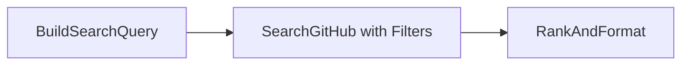
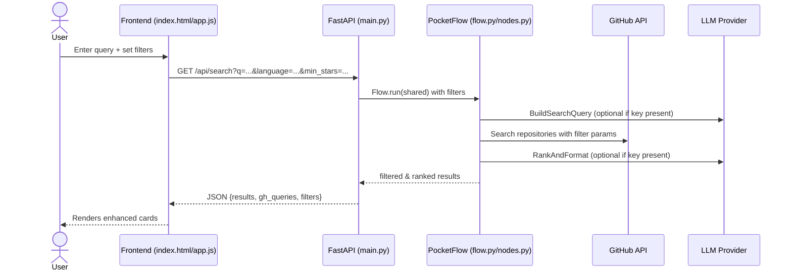

# AI GitHub Search (PocketFlow example)

An easy-to-host, good-looking, easy-setup web app to search GitHub repositories using natural language. Backend is Python FastAPI + PocketFlow; frontend is a static HTML page with Tailwind CSS.

## ✨ Features

- **Natural Language Search**: Convert plain English to GitHub search queries
- **Advanced Filtering**: Filter by language, stars, last updated, license
- **Smart Ranking**: AI-powered repository ranking (when API keys available)
- **Rich Results**: Stars, forks, language, license, size, issues, last updated
- **Responsive Design**: Works on desktop and mobile
- **Professional UI**: Clean, modern interface with Tailwind CSS

## Quick start

1) Create a virtualenv and install deps

```
pip install -r cookbook/ai-github-search/requirements.txt
```

2) Set environment variables (optional but recommended)

```
# PowerShell (Windows)
$env:GITHUB_TOKEN="ghp_your_token_here"        # GitHub API token
$env:GEMINI_API_KEY="your_gemini_key_here"     # Google Gemini API key
$env:LLM_PROVIDER="gemini"                     # Set to "gemini" for Gemini 2.5 Pro

# CMD (Windows)
set GITHUB_TOKEN=ghp_your_token_here
set OPENAI_API_KEY=sk-your-key
set LLM_PROVIDER=openai

# .env (optional): app auto-loads it
```

3) Run the dev server

```
python -m uvicorn cookbook.ai-github-search.main:app --host 127.0.0.1 --port 8000 --reload
```

Then open `http://127.0.0.1:8000`.

## 🔍 Advanced Filtering

The app now supports powerful filtering options:

### **Language Filter**
- JavaScript, Python, TypeScript, Java, Go, Rust, C++, C#, PHP, Ruby, Swift, Kotlin, Scala, Dart
- Or any custom language via GitHub's API

### **Stars Range**
- Minimum stars: Filter out low-popularity repos
- Maximum stars: Focus on emerging projects
- Example: `min_stars: 100, max_stars: 1000`

### **Last Updated**
- Date picker for "updated after" filtering
- Find actively maintained projects
- Avoid abandoned repositories

### **License Type**
- MIT, Apache 2.0, GPL 3.0, BSD 3-Clause, ISC, Unlicense, AGPL 3.0, LGPL 3.0
- Ensure compliance with your project requirements

### **Usage Examples**
```
# Find recent Python ML projects with 100+ stars
Language: Python
Min Stars: 100
Updated After: 2024-01-01

# Find MIT-licensed JavaScript frameworks
Language: JavaScript
License: MIT
Min Stars: 1000

# Find emerging Rust projects
Language: Rust
Max Stars: 500
Updated After: 2024-06-01
```

## Deploy

This app is self-contained and can be deployed to any Python host (Render, Railway, Fly.io, Azure App Service, etc.).

## Project layout

```
cookbook/ai-github-search/
  ├── README.md
  ├── requirements.txt
  ├── main.py              # FastAPI app, serves API and static UI
  ├── flow.py              # PocketFlow graph wiring
  ├── nodes.py             # Node implementations with advanced filtering
  ├── utils/
  │   └── call_llm.py      # Minimal LLM wrapper (OpenAI/Gemini/DeepSeek)
  └── static/
      ├── index.html       # UI with advanced filters (Tailwind via CDN)
      └── app.js           # Frontend logic with filter handling
```

## Configuration

- If no `OPENAI_API_KEY` (or other LLM key) is set, the app falls back to heuristics to build GitHub queries.
- If no `GITHUB_TOKEN` is set, the app still works but may hit rate limits.

## Diagrams

### Flow graph (PocketFlow)



### Request sequence



### Components

```mermaid
graph TD
    subgraph Frontend
        A[index.html with Filters]
        B[app.js with Filter Logic]
    end

    subgraph Backend
        C[FastAPI main.py with Filter Params]
        D[Flow wiring (flow.py)]
        E[Nodes with Advanced Filtering (nodes.py)]
        F[LLM wrapper (utils/call_llm.py)]
    end

    A --> B
    B -->|/api/search with filters| C
    C --> D --> E --> F
    E -->|httpx with filter params| GH[(GitHub API)]
```

## 🚀 What's New in v2.0

- **Advanced Filtering System**: Language, stars, dates, license
- **Enhanced Result Cards**: More metadata, better visual hierarchy
- **Improved Search Logic**: Better fallback handling, more results
- **Professional UI**: Collapsible filters, better spacing, responsive design
- **Enhanced Backend**: Filter validation, error handling, performance improvements


