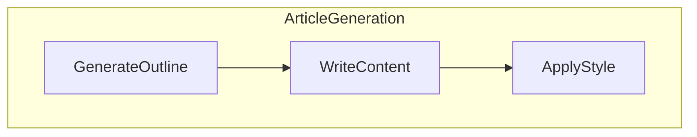
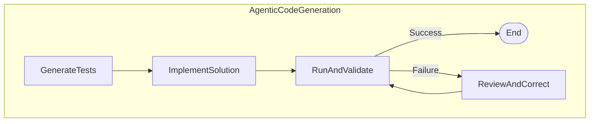

# Design Doc: Flow Conductor

> Please DON'T remove notes for AI

This document outlines the design for the Flow Conductor application, which is composed of multiple workflows.

---

## Workflow 1: Article Generation

### Requirements

The Flow Conductor is a backend system for an AI orchestration platform. The initial implementation focuses on a specific use case: automated article generation.

**User Story:** As a user, I want to provide a topic to the Flow Conductor system, and in return, the system should automatically generate a well-structured and styled article on that topic. I want to be able to track the progress of the generation in real-time through a web interface.

### Flow Design

**Applicable Design Pattern:** The system uses the **Workflow** design pattern. The task of writing an article is decomposed into a sequence of distinct steps: outlining, content writing, and styling. This creates a clear and manageable pipeline.

**Flow high-level Design:** The workflow consists of three main nodes executed in sequence:
1.  **Generate Outline**: Takes a topic from the user and generates a structured outline for the article.
2.  **Write Content**: For each section in the outline, this node writes a paragraph of content. This is a batch operation, processing each section independently.
3.  **Apply Style**: Takes the combined draft from the previous step and rewrites it to improve its style and engagement.



### Node Design

**Shared Store:** The shared store for this workflow is an in-memory dictionary.
```python
shared = {
    "topic": str,           # Input topic from the user
    "sse_queue": "asyncio.Queue", # Queue for sending progress updates to the frontend
    "sections": list[str],  # The article outline generated by the first node
    "draft": str,           # The combined content written for each section
    "final_article": str    # The final, styled article
}
```

**Node Steps:**
1. **GenerateOutline**
    - *Purpose*: To create a structured outline for the article from a given topic.
    - *Type*: Regular `Node`.
    - *Steps*:
      - *prep*: Reads the `topic` from the shared store.
      - *exec*: Calls the `call_llm` utility to generate a YAML-formatted list of sections.
      - *post*: Writes the `sections` to the shared store and sends a progress update.

2. **WriteContent**
    - *Purpose*: To generate content for each section of the outline.
    - *Type*: `BatchNode`.
    - *Steps*:
      - *prep*: Reads the `sections` list from the shared store.
      - *exec*: For each `section`, calls `call_llm` to write a paragraph and sends a progress update.
      - *post*: Combines the paragraphs into a `draft` and writes it to the shared store.

3. **ApplyStyle**
    - *Purpose*: To rewrite the draft article to improve its style.
    - *Type*: Regular `Node`.
    - *Steps*:
      - *prep*: Reads the `draft` from the shared store.
      - *exec*: Calls `call_llm` to rewrite the draft.
      - *post*: Writes the `final_article` to the shared store and sends a completion message.

---

## Workflow 2: Agentic Code Generation (Self-Correcting)

### Requirements

This workflow extends the Flow Conductor to support automated code generation. It uses an agentic, self-correcting loop to improve the reliability of the generated code.

**User Story:** As a developer, I want to provide a high-level problem description to the Flow Conductor, and have it autonomously generate a Python function, test it, and debug it until the tests pass.

### Flow Design

**Applicable Design Pattern:** This workflow uses a combination of the **Workflow** and **Agent** design patterns. It follows a TDD-like sequence, but incorporates an agentic decision node (`RunAndValidate`) and a correction loop.

**Flow high-level Design:**
1.  **Generate Tests**: Takes a problem description and generates unit tests.
2.  **Implement Solution**: Makes the first attempt at writing a Python function to solve the problem.
3.  **Run and Validate**: Executes the tests. If they pass, the flow succeeds. If they fail, it transitions to the `ReviewAndCorrect` step.
4.  **Review and Correct**: This agent node takes the failed code, tests, and error messages, and generates a new, corrected version of the code.
5.  The flow then **loops** back to `RunAndValidate` to try the new solution. This continues until the tests pass or a maximum number of retries is reached.



### Node Design

**Shared Store (additions):**
```python
"problem_description": str, # Input from the user
"generated_tests": str,     # Python code for the unit tests
"generated_solution": str,  # Python code for the solution function
"validation_result": dict,  # Result from the RunAndValidate node
"error_logs": list[str],    # A log of errors from failed validation attempts
"retry_count": int          # Counter to prevent infinite loops
```

**Node Steps:**
1. **GenerateTests**
    - *Purpose*: To generate unit tests from a problem description.
    - *Type*: Regular `Node`.
    - *Steps*: (Same as before)

2. **ImplementSolution**
    - *Purpose*: To write the initial version of the solution code.
    - *Type*: Regular `Node`.
    - *Steps*: (Same as before)

3. **RunAndValidate**
    - *Purpose*: To execute the tests and decide the next action.
    - *Type*: Regular `Node`.
    - *Steps*:
      - *prep*: Reads `generated_solution` and `generated_tests`.
      - *exec*: Uses the `execute_code` utility.
      - *post*:
        - If successful, returns the `"success"` action.
        - If failed, updates `error_logs` in the shared store, increments `retry_count`, and returns the `"failure"` action. If max retries are reached, it returns a final failure action.

4. **ReviewAndCorrect**
    - *Purpose*: To debug the solution code based on test failures.
    - *Type*: Regular `Node`.
    - *Steps*:
      - *prep*: Reads the `generated_solution`, `generated_tests`, and `error_logs`.
      - *exec*: Calls `call_llm` with a prompt that includes the code, tests, and errors, asking it to provide a corrected version of the code.
      - *post*: Overwrites the `generated_solution` in the shared store with the new, corrected code and sends a progress update.

## Common Utility Functions

1. **Call LLM** (`utils/call_llm.py`)
    - *Input*: `prompt` (str)
    - *Output*: `response` (str)
    - *Necessity*: Used by all nodes for LLM interaction.

2. **Execute Code** (`utils/code_executor.py`)
    - *Input*: `code_string` (str)
    - *Output*: A tuple of `(success: bool, output: str)`.
    - *Necessity*: Required by the `RunAndValidate` node to execute generated code.
