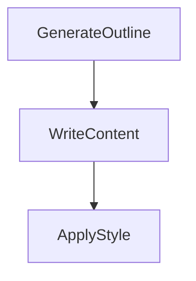

# Design Doc: Flow Conductor

> Please DON'T remove notes for AI

## Requirements

> Notes for AI: Keep it simple and clear.
> If the requirements are abstract, write concrete user stories

The Flow Conductor is a backend system for an AI orchestration platform. The initial implementation focuses on a specific use case: automated article generation.

**User Story:** As a user, I want to provide a topic to the Flow Conductor system, and in return, the system should automatically generate a well-structured and styled article on that topic. I want to be able to track the progress of the generation in real-time through a web interface.

## Flow Design

> Notes for AI:
> 1. Consider the design patterns of agent, map-reduce, rag, and workflow. Apply them if they fit.
> 2. Present a concise, high-level description of the workflow.

### Applicable Design Pattern:

The system uses the **Workflow** design pattern. The task of writing an article is decomposed into a sequence of distinct steps: outlining, content writing, and styling. This creates a clear and manageable pipeline.

### Flow high-level Design:

The workflow consists of three main nodes executed in sequence:

1.  **Generate Outline**: Takes a topic from the user and generates a structured outline for the article.
2.  **Write Content**: For each section in the outline, this node writes a paragraph of content. This is a batch operation, processing each section independently.
3.  **Apply Style**: Takes the combined draft from the previous step and rewrites it to improve its style and engagement.



## Utility Functions

> Notes for AI:
> 1. Understand the utility function definition thoroughly by reviewing the doc.
> 2. Include only the necessary utility functions, based on nodes in the flow.

1. **Call LLM** (`utils/call_llm.py`)
    - *Input*: `prompt` (str)
    - *Output*: `response` (str)
    - *Necessity*: This is the core utility function used by all nodes to interact with the Large Language Model. For the initial implementation, this is a dummy function that returns predefined text based on the prompt.

## Node Design

### Shared Store

> Notes for AI: Try to minimize data redundancy

The shared store is an in-memory dictionary used for communication between nodes.

```python
shared = {
    "topic": str,           # Input topic from the user
    "sse_queue": "asyncio.Queue", # Queue for sending progress updates to the frontend
    "sections": list[str],  # The article outline generated by the first node
    "draft": str,           # The combined content written for each section
    "final_article": str    # The final, styled article
}
```

### Node Steps

> Notes for AI: Carefully decide whether to use Batch/Async Node/Flow.

1. **GenerateOutline**
    - *Purpose*: To create a structured outline for the article from a given topic.
    - *Type*: Regular `Node`.
    - *Steps*:
      - *prep*: Reads the `topic` from the shared store.
      - *exec*: Calls the `call_llm` utility with a prompt to generate a YAML-formatted list of sections. It then parses the YAML to extract the list.
      - *post*: Writes the list of `sections` to the shared store and sends a progress update to the frontend via the `sse_queue`.

2. **WriteContent**
    - *Purpose*: To generate a paragraph of content for each section of the article outline.
    - *Type*: `BatchNode`, as it processes a list of sections.
    - *Steps*:
      - *prep*: Reads the `sections` list from the shared store and returns it as an iterable for batch processing.
      - *exec*: For each `section` in the list, it calls the `call_llm` utility to write a paragraph. It also sends a progress update for each section processed via the `sse_queue`.
      - *post*: Combines the generated paragraphs into a single `draft` string and writes it to the shared store.

3. **ApplyStyle**
    - *Purpose*: To rewrite the drafted article to improve its tone and style.
    - *Type*: Regular `Node`.
    - *Steps*:
      - *prep*: Reads the `draft` from the shared store.
      - *exec*: Calls the `call_llm` utility with a prompt to rewrite the draft in a more conversational and engaging style.
      - *post*: Writes the rewritten content as the `final_article` in the shared store and sends a "complete" message to the frontend via the `sse_queue`.
